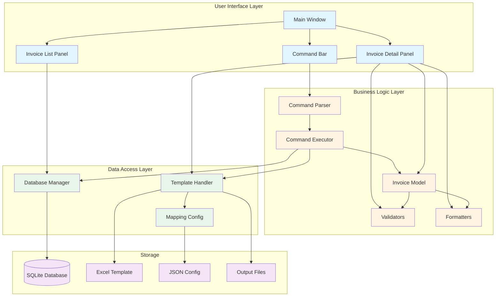
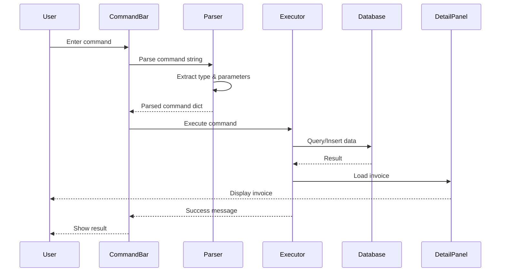
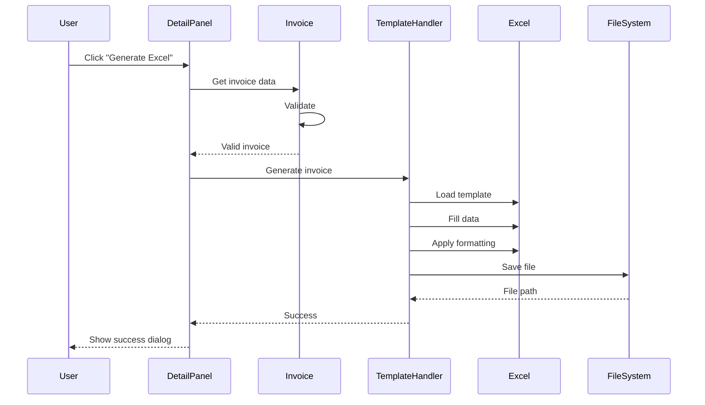
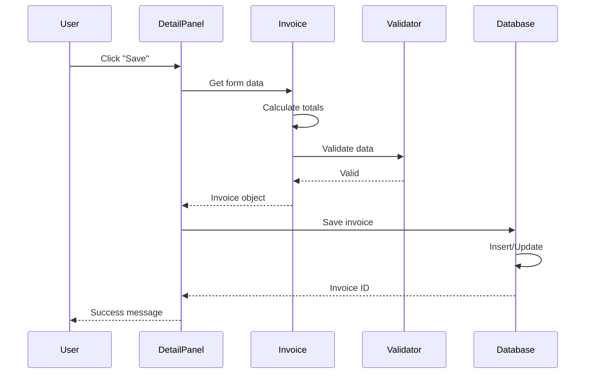
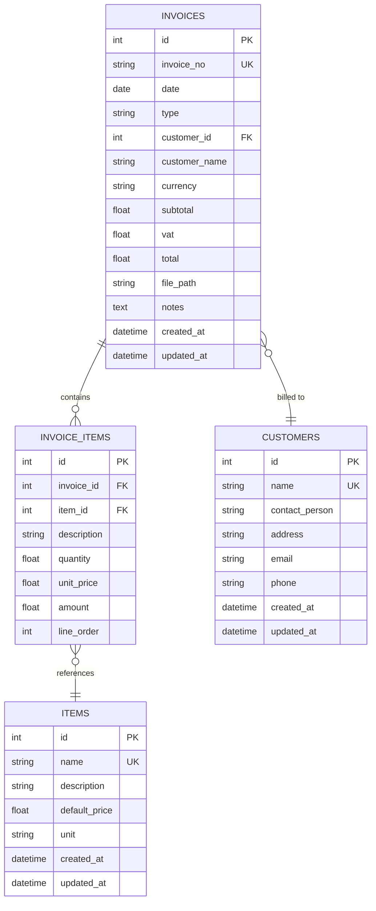

# Invoice Command Studio - Architecture

## System Architecture Diagram



## Component Interaction Flow

### 1. Command Execution Flow



### 2. Excel Generation Flow



### 3. Invoice Save Flow



## Data Model



## Technology Stack

| Layer | Technology | Purpose |
|-------|-----------|---------|
| **GUI Framework** | PySide6 (Qt6) | Native Windows interface |
| **Database** | SQLite3 | Lightweight data storage |
| **Excel Processing** | openpyxl | Read/write .xlsx files |
| **PDF Generation** | reportlab | Future PDF export |
| **Language** | Python 3.11+ | Application logic |
| **Style** | Fusion | Modern Qt style |

## Design Patterns Used

1. **MVC (Model-View-Controller)**
   - Models: `Invoice`, `Customer`, `Item`
   - Views: GUI widgets (`MainWindow`, panels)
   - Controllers: `CommandExecutor`, `DatabaseManager`

2. **Singleton**
   - `CommandParser` instance
   - `DatabaseManager` connection

3. **Observer (Signal/Slot)**
   - Qt signals for component communication
   - Event-driven architecture

4. **Strategy**
   - Different VAT calculation strategies for Tax/Normal invoices

5. **Template Method**
   - Excel template filling process

## File Organization

```
invoice_studio/
├── database/          # Data persistence
├── commands/          # Command processing
├── excel/            # Excel operations
├── gui/              # User interface
├── models/           # Business entities
└── utils/            # Helper functions
```

Each module has clear responsibilities and minimal coupling.
